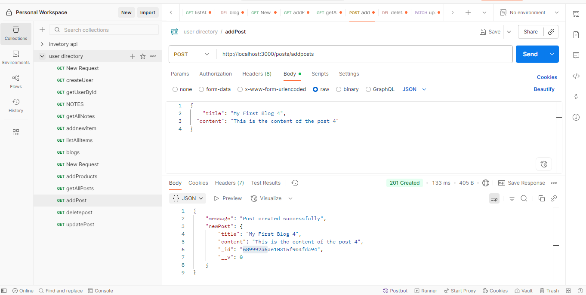
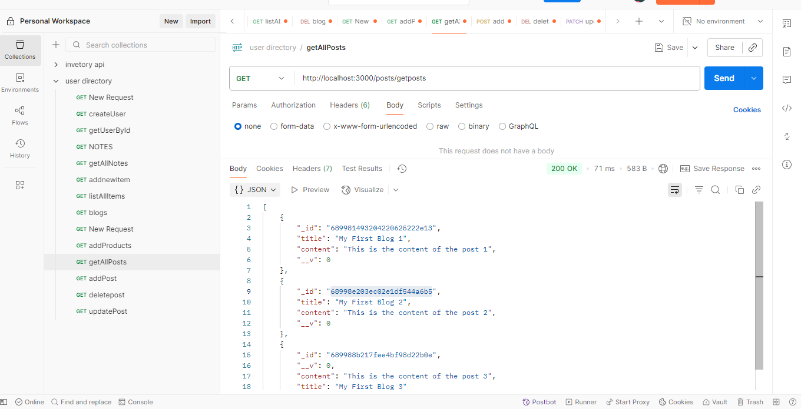
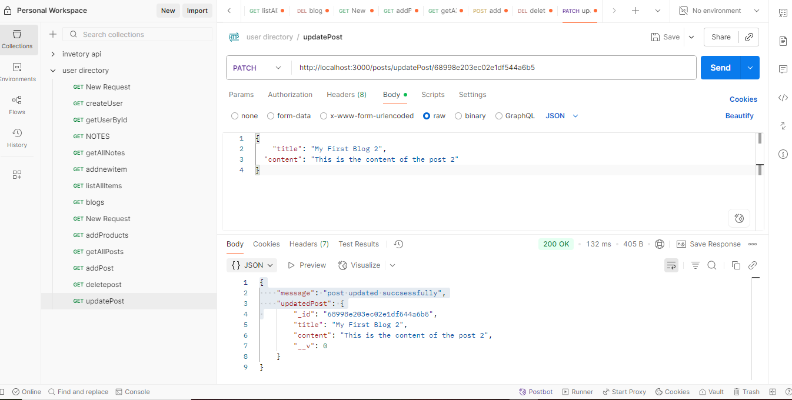
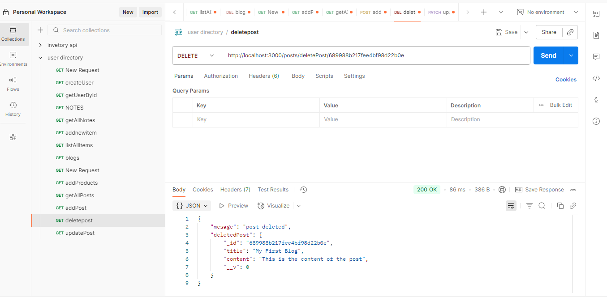

# 📝 Post Management API (Backend)

This is a simple blog post management backend built with **Node.js**, **Express**, and **MongoDB** using **Mongoose**.  
It provides RESTful API endpoints to create, read, update, and delete blog posts, tested using **Postman**.

---

## 📦 Features

- Express server setup with routing
- MongoDB Atlas connection using Mongoose
- CRUD operations:
  - Create a new post
  - List all posts
  - Update a post
  - Delete a post
- Tested using Postman

---

## 🛠️ Technologies Used

- Node.js
- Express.js
- MongoDB (Atlas)
- Mongoose
- Postman (for testing)

---
## 📁 Folder Structure   

post-api/
├── controllers/
│ └── postController.js
├── media/
│ ├── addPost.png
│ ├── deletedPost.png
│ ├── getAllPosts.png
│ └── postUpdated.png
├── models/
│ └── postModels.js
├── routes/
│ └── postRoutes.js
├── .env
├── .gitignore
├── package-lock.json
├── package.json
├── README.md
└── server.js
---

## 📷 Postman API Testing

### 🔹 POST `/posts/addPosts` – Add New Post

---

### 🔹 GET `/posts/getPosts` – List All Posts

---

### 🔹 PATCH `/posts/updatePost/:id` – Update Post

---

### 🔹 DELETE `/posts/deletePost/:id` – Delete Post

---

# Install dependencies
npm install

# Create a .env file
PORT=3000
MONGO_URI=your_mongo_connection_string

# Start the server
npm start

## 📁 Folder Structure

